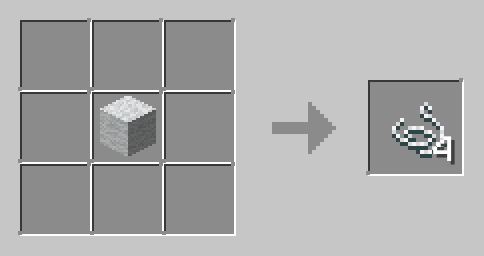
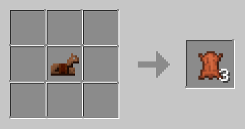
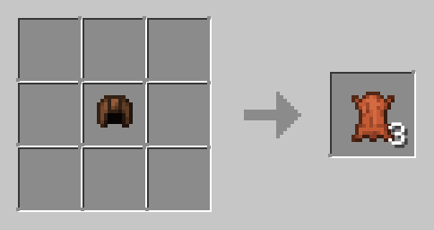
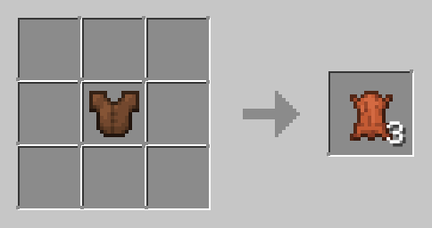
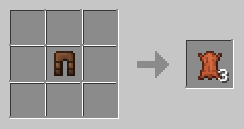
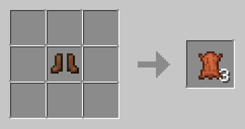
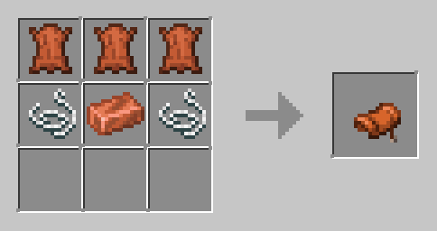
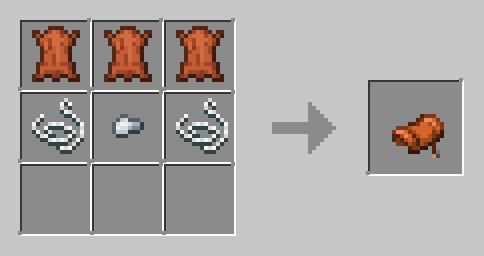
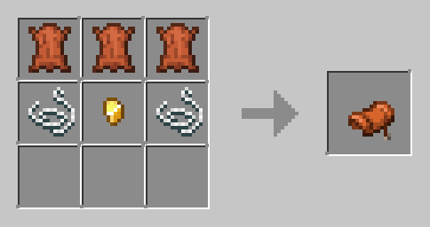
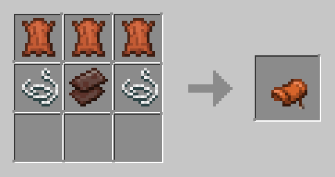

# Simple String and Leather datapack for Minecraft 1.19

This datapack adds a simple string and leather recipes to Minecraft.
It has recipes for string from wool and leather from leather (horse) armor.
Additionally, a recipe to craft a saddle from leather, metal and string has been added.

## Recipes

### String

This can be crafted from any color of wool.

### Leather

### Saddle

## Installation

1. Download the latest release from the [releases page](https://github.com/n4bul4/string-leather-datapack/releases/latest).
2. Save the zip file in your world's datapacks folder. (e.g. `C:\Users\USERNAME\AppData\Roaming\.minecraft\saves\WORLDNAME\datapacks`) (No need to unzip)
3. If you're installing this datapack on an existing world, you need to run `/reload` in-game or press `F3 + T` to load the datapack. If this doesn't work, try restarting the game.
